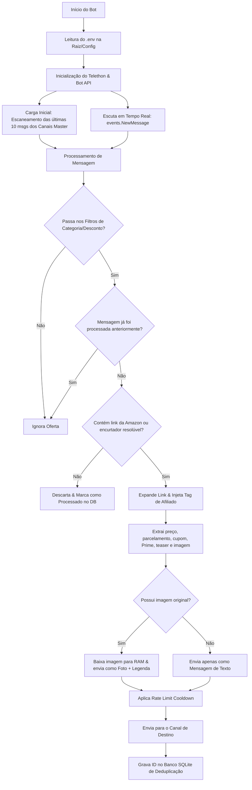

# RadarJarbis Bot 🤖

O **RadarJarbis** é o motor de automação exclusivo do ecossistema de afiliados `@noradardojarbis`. Ele foi projetado para monitorar canais de ofertas master do Telegram, filtrar as promoções relevantes, converter links da Amazon para conter sua tag de afiliado de forma automática (inclusive expandindo encurtadores) e publicar em um canal de saída.

---

## 🚀 Como Iniciar

### 1. Configuração do Ambiente (.env)
O bot suporta a leitura do arquivo `.env` na raiz do projeto (como primeira opção) ou na pasta `config/.env` (como fallback).

Copie o arquivo de exemplo e preencha suas credenciais do Telegram e de Afiliado Amazon:
```bash
cp config/.env.example .env
```

Campos obrigatórios no `.env`:
* `TELEGRAM_API_ID`: ID da API de sua conta (MTProto).
* `TELEGRAM_API_HASH`: Hash da API de sua conta (MTProto).
* `TELEGRAM_BOT_TOKEN`: Token do bot gerado pelo [@BotFather](https://t.me/BotFather).
* `SOURCE_CHANNEL_IDS`: IDs numéricos ou usernames (ex: `@gugaaprova`) dos canais de origem monitorados (separados por vírgula).
* `OUTPUT_CHANNEL_ID`: Canal do Telegram de destino para publicação das ofertas (ex: `@noradardojarbis`).
* `AMAZON_AFFILIATE_TAG`: Sua tag de associado Amazon (ex: `noradardojarb-20`).
* `RATE_LIMIT_DELAY`: Cooldown entre postagens em segundos (padrão `3.5`).

---

## 💻 Execução Local

Para rodar o bot diretamente através do ambiente virtual:

1. Instale as dependências:
   ```bash
   .venv/bin/pip install -r requirements.txt
   ```

2. Execute o bot:
   ```bash
   .venv/bin/python -m src.bot
   ```
   *(Nota: Na primeira execução, o Telethon solicitará o número de telefone e o código OTP enviado no seu Telegram para criar a sessão persistente).*

---

## ⚙️ Gerenciamento via Systemd (Hospedagem em Produção)

O bot está configurado como um serviço de sistema (systemd) para rodar de forma persistente em segundo plano no Linux.

### Comandos de Controle do Serviço:

* **Visualizar logs em tempo real:**
  ```bash
  sudo journalctl -u radar-jarbis.service -f -n 50
  ```

* **Verificar o status detalhado:**
  ```bash
  sudo systemctl status radar-jarbis.service
  ```

* **Reiniciar o bot (necessário após alterar o `.env`):**
  ```bash
  sudo systemctl restart radar-jarbis.service
  ```

* **Parar a execução do bot:**
  ```bash
  sudo systemctl stop radar-jarbis.service
  ```

---

## 🛠️ Arquitetura e Fluxo de Funcionamento

