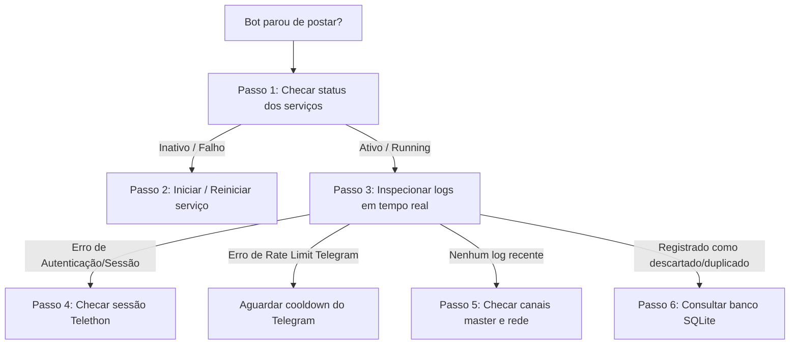

# 📖 Manual de Diagnóstico e Troubleshooting — RadarJarbis

Este guia contém o passo a passo completo para investigar, diagnosticar e restabelecer o bot quando ele parar de postar ou apresentar comportamento inesperado.

---

## 🧭 Fluxo Rápido de Diagnóstico



---

## 🛠️ Passo 1: Verificar se os Serviços estão Ativos

Execute no terminal da VM:

```bash
# Se estiver rodando como serviço de usuário (padrão com linger)
systemctl --user status radar-jarbis.service radar-jarbis-meli.service

# Se estiver rodando como serviço de sistema (/etc/systemd/system/)
sudo systemctl status radar-jarbis.service radar-jarbis-meli.service
```

### O que observar:
- **`Active: active (running)`**: O processo está de pé.
- **`Active: inactive (dead)`**: O serviço foi encerrado.
- **`Active: failed`**: O serviço crashou com erro.

Se estiver parado ou falho, inicie com:
```bash
systemctl --user start radar-jarbis.service radar-jarbis-meli.service
```

---

## 📜 Passo 2: Inspecionar os Logs (Journalctl)

Os logs contêm as mensagens estruturadas em JSON de tudo que o bot está processando.

### 2.1 Ver os últimos 50 logs:
```bash
journalctl --user -u radar-jarbis.service -u radar-jarbis-meli.service -n 50 --no-pager
```

### 2.2 Acompanhar logs em tempo real:
```bash
# Bot Amazon
journalctl --user -u radar-jarbis.service -f

# Bot Mercado Livre
journalctl --user -u radar-jarbis-meli.service -f
```

### 2.3 Investigar o que aconteceu em um horário específico (ex: ontem entre 21h e 22h):
```bash
journalctl --user -u radar-jarbis.service -u radar-jarbis-meli.service \
  --since "yesterday 21:00:00" --until "yesterday 22:00:00" --no-pager
```

### 2.4 Padrões comuns nos logs:
| Mensagem / Erro nos Logs | Causa | O que fazer |
| :--- | :--- | :--- |
| `Telethon conectado com sucesso!` | Conexão MTProto ativa e saudável | Operação normal |
| `Stopping radar-jarbis...` | Sessão encerrou ou comando de stop recebido | Checar se o `Linger` está ativo (`loginctl show-user $USER \| grep Linger`) |
| `FloodWaitError` | Rate limit temporário imposto pelo Telegram | O bot aguarda automaticamente o cooldown e retenta |
| `Address already in use` | Porta de métricas Prometheus já ocupada | O bot ignora e continua rodando; ou ajustar `METRICS_PORT` no `.env` |
| `database is locked` | Múltiplos processos acessando a sessão SQLite | Encerrar instâncias duplicadas (`pkill -f src.bot`) |
| `Reprovado pelo filtro de relevância` | Mensagem sem palavras-chave ou desconto mínimo | Oferta descartada conforme regras de negócio |
| `Descartado: Produto já postado recentemente` | Deduplicação por ASIN/Item Meli ativa | Comportamento esperado para evitar spam |

---

## 💾 Passo 3: Consultar o Banco de Estado (Deduplicação)

Para checar quando a última mensagem foi registrada no banco SQLite:

```bash
cd /home/robson/projetos/radar-jarbis

.venv/bin/python -c "
import sqlite3
conn = sqlite3.connect('config/state.db')
c = conn.cursor()
c.execute('SELECT msg_id, posted_at, asin, price FROM posted_messages ORDER BY rowid DESC LIMIT 10;')
print('--- ÚLTIMAS 10 POSTAGENS / REGISTROS ---')
for row in c.fetchall():
    print(row)
"
```

---

## 🔒 Passo 4: Verificar a Persistência de Segundo Plano (Linger)

Se o bot parar sempre que você fecha o terminal ou desconecta do SSH:

```bash
loginctl show-user $(whoami) | grep Linger
```

- Se retornar **`Linger=no`**, ative com:
  ```bash
  loginctl enable-linger $(whoami)
  ```

---

## 🔄 Passo 5: Comandos de Reinício Rápido e Limpeza

Se precisar reiniciar do zero com segurança:

```bash
# 1. Reiniciar os serviços
systemctl --user restart radar-jarbis.service radar-jarbis-meli.service

# 2. Verificar se ambos subiram normalmente
systemctl --user status radar-jarbis.service radar-jarbis-meli.service

# 3. Executar a suíte de testes automatizados para validar a integridade
.venv/bin/python -m unittest discover -s tests -v
```

---

## 🆘 Procedimento em caso de Travamento Total (Hang)

Se os serviços parecerem presos ou não responderem:

```bash
# 1. Parar os serviços no systemd
systemctl --user stop radar-jarbis.service radar-jarbis-meli.service

# 2. Garantir que nenhum processo órfão de python ficou preso
pkill -f "src.bot"

# 3. Iniciar novamente
systemctl --user start radar-jarbis.service radar-jarbis-meli.service
```
