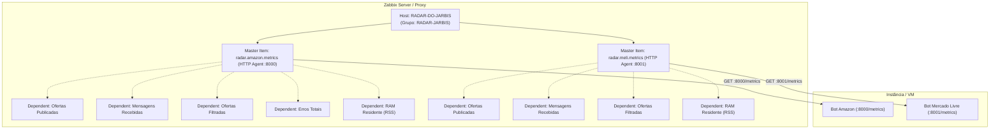

# 📊 Monitoramento Zabbix — Radar Jarbis

Este documento descreve como configurar o monitoramento no Zabbix utilizando os endpoints Prometheus nativos dos bots do Radar Jarbis (Amazon e Mercado Livre).

---

## 🎯 Estrutura do Host `RADAR-DO-JARBIS` (Grupo: `RADAR-JARBIS`)

O host `RADAR-DO-JARBIS` (pertencente ao grupo de hosts `RADAR-JARBIS`) é dedicado exclusivamente às **métricas de aplicação e de negócio**. Os recursos de sistema operacional (CPU geral da VM, disco, rede) devem ficar em um host separado (ex: com Template Linux by Zabbix agent).

---

## 🚀 Como Importar o Host Diretamente no Zabbix

1. Baixe ou copie o arquivo [`docs/zabbix_host_radar_jarbis.yaml`](file:///home/robson/projetos/radar-jarbis/docs/zabbix_host_radar_jarbis.yaml).
2. No painel Web do Zabbix, vá em:
   - **Data collection** (ou **Configuration**) ➡️ **Hosts**
   - Clique no botão **Import** (canto superior direito)
   - Selecione o arquivo `docs/zabbix_host_radar_jarbis.yaml`
   - Marque as opções de atualização e clique em **Import**.
3. No host recém-criado `RADAR-DO-JARBIS`, ajuste a interface (IP / DNS) para apontar para o IP da sua VM.

---

## 📋 Lista de Itens Criados

### 1. Bot Amazon
- **Item Mestre**: `Amazon - Raw Prometheus Metrics` (`radar.amazon.metrics`, HTTP Agent em `http://{HOST.CONN}:8000/metrics`)
- **Itens Dependentes (Prometheus pattern)**:
  - `radar_messages_received_total` ➡️ Mensagens recebidas dos canais de entrada.
  - `radar_offers_published_total` ➡️ Ofertas validadas e postadas no canal de saída.
  - `radar_offers_filtered_total` ➡️ Ofertas descartadas por regras de filtros/desconto.
  - `radar_errors_total` ➡️ Quantidade total de erros e exceções capturadas.
  - `radar_reconnect_attempts` ➡️ Tentativas de reconexão do MTProto.
  - `process_resident_memory_bytes` ➡️ Consumo real de memória RAM do processo.

### 2. Bot Mercado Livre
- **Item Mestre**: `Mercado Livre - Raw Prometheus Metrics` (`radar.meli.metrics`, HTTP Agent em `http://{HOST.CONN}:8001/metrics`)
- **Itens Dependentes (Prometheus pattern)**:
  - `radar_meli_messages_received_total` ➡️ Mensagens recebidas dos canais Meli.
  - `radar_meli_offers_published_total` ➡️ Ofertas Meli convertidas e publicadas.
  - `radar_meli_offers_filtered_total` ➡️ Ofertas descartadas por regras de filtros.
  - `process_resident_memory_bytes` ➡️ Consumo real de memória RAM do processo.

---

## 🚨 Triggers de Alerta

- **`Radar Jarbis - Bot Amazon Indisponível`**: Dispara se o endpoint `http://IP:8000/metrics` parar de responder por mais de 3 minutos.
- **`Radar Jarbis - Bot Mercado Livre Indisponível`**: Dispara se o endpoint `http://IP:8001/metrics` parar de responder por mais de 3 minutos.
