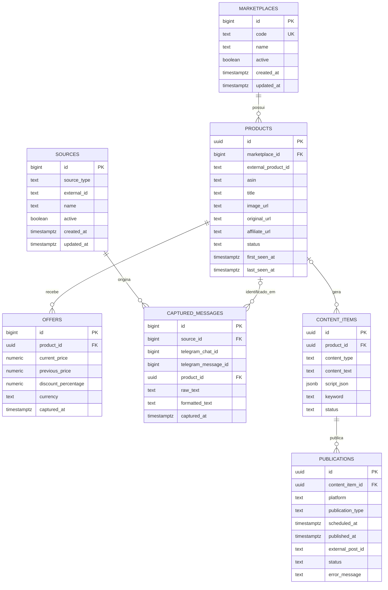

# Banco de dados

O schema inicial prepara o PostgreSQL do Supabase para múltiplos marketplaces. Amazon Brasil é o marketplace inicial; Mercado Livre e outros podem ser incluídos sem alterar a identidade dos produtos.

O banco armazena apenas metadados e texto. Imagens e vídeos não são armazenados no PostgreSQL nem no Supabase Storage.

## Diagrama lógico



## Decisões do modelo

- Produtos são identificados por `(marketplace_id, external_product_id)`. `asin` é opcional e específico da Amazon.
- Preços usam `numeric`, evitando erros de ponto flutuante.
- Datas usam `timestamptz` e devem ser tratadas em UTC pela aplicação.
- URLs de imagem são apenas referências textuais; nenhum arquivo binário é persistido.
- Exclusões preservam histórico quando necessário: mensagens e conteúdos mantêm a linha e recebem `product_id = null`; ofertas são removidas com o produto.
- As tabelas em `public` têm RLS habilitado e não possuem políticas para clientes. Até uma migration futura definir o modelo de acesso, `anon` e `authenticated` não devem acessar linhas.
- `updated_at` é atualizado por triggers. `offers` e `captured_messages` são eventos imutáveis e, por isso, não possuem `updated_at`.

## Aplicação manual pelo SQL Editor

1. Abra o projeto correto no painel do Supabase.
2. Acesse **SQL Editor** e crie uma nova consulta.
3. Copie todo o conteúdo de `supabase/migrations/001_initial_schema.sql`.
4. Confirme que o editor está conectado ao projeto e ambiente desejados.
5. Execute a consulta uma única vez. A migration usa uma transação: qualquer erro deve provocar rollback integral.
6. No **Table Editor**, confirme a criação das sete tabelas e o registro `amazon_br` em `marketplaces`.
7. No SQL Editor, valide RLS, tabelas e índices com as consultas abaixo.

```sql
select tablename, rowsecurity
from pg_tables
where schemaname = 'public'
  and tablename in (
    'marketplaces', 'sources', 'products', 'offers',
    'captured_messages', 'content_items', 'publications'
  )
order by tablename;

select tablename, indexname
from pg_indexes
where schemaname = 'public'
  and tablename in (
    'marketplaces', 'sources', 'products', 'offers',
    'captured_messages', 'content_items', 'publications'
  )
order by tablename, indexname;
```

Não inclua URL, senha do banco, secret key ou service role no SQL versionado.

## Rollback manual

O rollback remove todas as tabelas deste schema inicial e seus dados. Use-o somente antes de existir informação que precise ser preservada.

1. Faça backup ou confirme que os dados podem ser descartados.
2. Abra uma nova consulta no SQL Editor.
3. Copie `supabase/migrations/001_initial_schema_rollback.sql`.
4. Revise o projeto selecionado e execute a consulta.

Nenhuma migration é aplicada automaticamente por estes arquivos.
